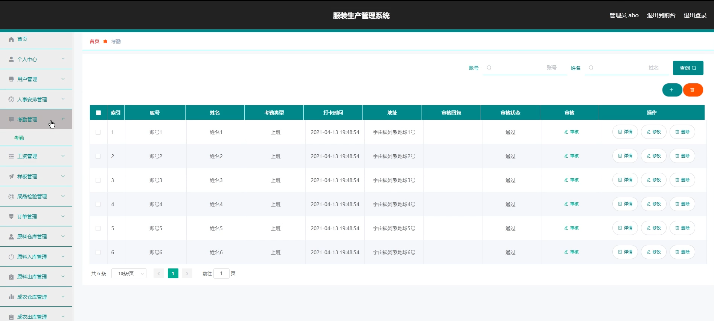

# 基于springboot的服装生产管理的设计与实现

#### 介绍

在日益激烈的市场竞争中，服装企业对于生产管理的精细化和高效化需求愈发迫切。为了满足这一需求，我们设计并开发了一款基于Spring Boot的服装生产管理系统。该系统结合了现代信息技术的优势，通过自动化、智能化的管理手段，实现了对服装生产全过程的实时监控和精准控制，有效提升了生产效率和产品质量，降低了管理成本。

#### 技术栈

后端技术栈：Springboot+Mysql+Maven

前端技术栈：Vue+Html+Css+Javascript+ElementUI

开发工具：Idea+Vscode+Navicate

#### 系统功能介绍

管理员角色功能模块  
个人中心：管理员可以方便地查看和修改个人信息，包括姓名、联系方式、职务等，并进行密码重置等安全操作，确保账户安全。  
用户管理：管理员可以全面管理用户信息，包括添加新用户、删除无效用户、修改用户权限等，确保系统的安全性和稳定性。  
人事安排管理：根据生产需求和员工能力，进行岗位分配、班次设置、人员调动等人事管理工作，优化人力资源配置。  
考勤管理：系统能够自动记录员工的考勤情况，包括迟到、早退、请假等，并生成详细的考勤报表，便于管理员进行统计分析。  
工资管理：根据员工的考勤和绩效情况，系统自动计算并发放工资，减少人工操作的错误和繁琐。  
样板管理：对服装样板进行数字化存储和管理，方便查询、修改和删除，确保样板的准确性和完整性。  
成品检验管理：对生产出的成品进行质量检验，确保产品质量符合标准，并记录检验结果供后续分析。  
订单管理：接收、处理和跟踪客户订单，确保订单按时完成，提高客户满意度。  
原料仓库管理：实时掌握原料仓库的库存情况，进行入库、出库等管理操作，确保原料的合理使用和库存安全。  
成衣仓库管理：对成衣仓库的库存、入库、出库等信息进行实时管理，确保产品准确送达客户。  
系统管理：包括系统参数设置、数据备份与恢复、用户日志查看等功能，确保系统的正常运行和数据安全。  

用户角色功能模块  
人事安排：用户可以查看自己的人事安排信息，如岗位、班次等，了解自己的工作安排。  
样板：用户可以查看和管理与自己工作相关的样板信息，确保生产过程中的准确性。  
系统公告：系统发布各类公告信息，如公司新闻、系统更新等，用户可以随时查看，了解公司动态和系统变化。  
个人中心：用户可以查看和修改个人信息，以及进行密码重置等操作，确保账户安全。  
考勤管理：用户可以查看自己的考勤记录，了解自己的出勤情况，方便进行自我管理。    
工资管理：用户可以查看自己的工资发放记录，了解自己的薪资情况，确保薪资发放的准确性和及时性。  

#### 系统作用

本服装生产管理系统在服装企业的生产管理过程中，发挥了以下几个方面的显著作用：

提升生产效率：系统通过自动化和智能化的手段，对生产流程进行精细化管理，优化资源配置，减少人工操作错误，从而显著提高生产效率。  
保障产品质量：系统提供成品检验管理功能，确保每一件产品都经过严格的质量检验，从而保障产品质量，提高客户满意度。  
降低管理成本：通过自动化管理，系统减少了大量的人工操作，降低了人力成本。同时，实时数据监控和分析功能帮助管理员快速发现潜在问题，减少资源浪费，进一步降低管理成本。  
优化库存管理：系统对原料和成衣仓库进行实时管理，确保库存信息的准确性和及时性。管理员可以根据库存情况及时调整生产计划和采购计划，避免库存积压和缺货现象的发生。  
提高决策效率：系统提供全面的数据分析功能，管理员可以根据生产数据、销售数据等信息进行决策分析，制定更加科学合理的生产计划和销售策略，提高决策效率。  
增强企业竞争力：通过提升生产效率、保障产品质量、降低管理成本等方面的作用，该系统有助于服装企业提高市场竞争力，赢得更多客户的信任和支持。  

#### 系统功能截图

代码结构

数据库表

登录

用户管理

人事安排管理

考勤管理

订单管理

成品检验管理

原料仓库管理

系统管理

前台页面人事安排

样板

用户端后台管理

#### 总结

基于Spring Boot的服装生产管理系统是一款功能强大、易于使用的生产管理工具。通过该系统，服装企业可以实现对生产全过程的精细化管理，提高生产效率和产品质量，降低管理成本。同时，系统还具备高度的可扩展性和可定制性，能够满足不同企业的个性化需求。我们相信，在未来的发展中，该系统将成为服装行业生产管理的重要工具之一，为企业的可持续发展提供有力支持。

#### 使用说明

创建数据库，执行数据库脚本 修改jdbc数据库连接参数 下载安装maven依赖jar 启动idea中的springboot项目

后台地址：http://localhost:8080/springbootww862/admin/dist/index.html

管理员  abo 密码 abo

前台地址：http://localhost:8080/springbootww862/front/index.html

